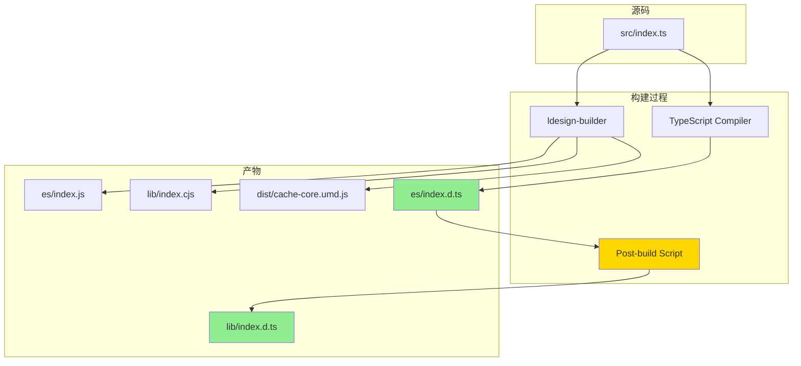

# 🔧 @ldesign/cache DTS 产物优化方案

## 📋 问题诊断

### 当前架构
```
packages/cache/
├── packages/
│   ├── core/          (@ldesign/cache-core)
│   └── vue/           (@ldesign/cache-vue)
└── (根包聚合层)
```

### 🚨 发现的问题

#### 1. **DTS 输出目录配置错误**

**packages/core/builder.config.ts (第23-26行)**:
```typescript
dts: {
  enabled: true,
  outDir: 'dist',  // ❌ 错误!应该输出到 es 和 lib
}
```

**实际需要**:
- ✅ `es/` 目录需要 `.d.ts` 文件 (用于 ESM import)
- ✅ `lib/` 目录需要 `.d.ts` 文件 (用于 CJS require)
- ❌ 当前只输出到 `dist/` 目录

#### 2. **package.json exports 配置不匹配**

**packages/core/package.json (第18-22行)**:
```json
"exports": {
  ".": {
    "types": "./es/index.d.ts",      // ✅ 指向 es/
    "import": "./es/index.js",        // ✅ ESM
    "require": "./lib/index.cjs"      // ✅ CJS 但缺少对应的 .d.ts!
  }
}
```

**问题**: 
- CJS 用户使用 `require()` 时,TypeScript 无法找到类型定义
- 虽然 `types` 字段指向 `es/index.d.ts`,但某些工具可能需要 `lib/index.d.ts`

#### 3. **配置文件冗余**

两个子包都有:
- `builder.config.ts` - 新版配置
- `ldesign.config.ts` - 旧版配置?

**建议**: 统一使用 `builder.config.ts`

---

## 🎯 优化方案

### 方案一:使用 Builder 的多目标 DTS 输出(推荐)

修改 `builder.config.ts` 使用更明确的配置:

```typescript
// packages/core/builder.config.ts
import { defineConfig } from '@ldesign/builder'

export default defineConfig({
  entry: 'src/index.ts',
  output: {
    formats: ['esm', 'cjs', 'umd'],
    name: 'LDesignCacheCore',
    dir: {
      esm: 'es',
      cjs: 'lib',
      umd: 'dist',
    },
    fileName: {
      esm: '[name].js',
      cjs: '[name].cjs',  // 明确使用 .cjs 扩展名
      umd: 'cache-core.umd.js',
    },
  },
  external: [],
  dts: {
    enabled: true,
    // 方案 A: 如果 builder 支持多输出目录
    outDir: ['es', 'lib'],  
    
    // 方案 B: 或者明确为每种格式配置
    // esm: { outDir: 'es' },
    // cjs: { outDir: 'lib' },
  },
  minify: {
    enabled: true,
    formats: ['umd'],
  },
  sourcemap: true,
  clean: true,
})
```

### 方案二:后处理脚本复制 DTS

如果 builder 不支持多目标输出,添加构建后脚本:

```typescript
// packages/core/scripts/copy-dts.ts
import { copyFileSync, readdirSync, statSync } from 'fs'
import { join } from 'path'

function copyDtsFiles(from: string, to: string) {
  const files = readdirSync(from)
  for (const file of files) {
    const fromPath = join(from, file)
    const toPath = join(to, file)
    
    if (statSync(fromPath).isDirectory()) {
      copyDtsFiles(fromPath, toPath)
    } else if (file.endsWith('.d.ts')) {
      copyFileSync(fromPath, toPath)
      console.log(`Copied: ${fromPath} -> ${toPath}`)
    }
  }
}

// 从 es/ 复制到 lib/
copyDtsFiles('es', 'lib')
```

更新 `package.json`:
```json
{
  "scripts": {
    "build": "ldesign-builder build -f esm,cjs,dts && tsx scripts/copy-dts.ts"
  }
}
```

### 方案三:使用 package.json types 条件导出(最新标准)

更新 package.json 以支持完整的类型解析:

```json
{
  "exports": {
    ".": {
      "types": "./es/index.d.ts",
      "import": {
        "types": "./es/index.d.ts",
        "default": "./es/index.js"
      },
      "require": {
        "types": "./lib/index.d.ts",  // CJS 专用类型
        "default": "./lib/index.cjs"
      }
    }
  },
  "main": "./lib/index.cjs",
  "module": "./es/index.js",
  "types": "./es/index.d.ts",
  "typings": "./es/index.d.ts"
}
```

---

## 🔄 实施步骤

### Step 1: 优化 packages/core

#### 1.1 更新 builder.config.ts
```typescript
export default defineConfig({
  entry: 'src/index.ts',
  output: {
    formats: ['esm', 'cjs', 'umd'],
    name: 'LDesignCacheCore',
    dir: {
      esm: 'es',
      cjs: 'lib',
      umd: 'dist',
    },
    fileName: {
      esm: '[name].js',
      cjs: '[name].cjs',
      umd: 'cache-core.umd.js',
    },
  },
  dts: {
    enabled: true,
    // 确保两个目录都有 dts
    outDir: 'es',  // 主输出
    // 通过后处理复制到 lib
  },
  sourcemap: true,
  clean: true,
})
```

#### 1.2 添加 DTS 复制脚本
创建 `packages/core/scripts/post-build.ts`:
```typescript
import { cpSync, existsSync, mkdirSync } from 'fs'
import { join } from 'path'

const esDir = join(process.cwd(), 'es')
const libDir = join(process.cwd(), 'lib')

// 复制所有 .d.ts 和 .d.ts.map 文件
function copyDtsRecursive(src: string, dest: string) {
  if (!existsSync(dest)) {
    mkdirSync(dest, { recursive: true })
  }
  
  cpSync(src, dest, {
    recursive: true,
    filter: (source) => {
      return source.endsWith('.d.ts') || source.endsWith('.d.ts.map')
    },
  })
}

console.log('📦 Copying DTS files from es/ to lib/...')
copyDtsRecursive(esDir, libDir)
console.log('✅ DTS files copied successfully!')
```

#### 1.3 更新 package.json
```json
{
  "scripts": {
    "build": "ldesign-builder build -f esm,cjs,dts && tsx scripts/post-build.ts",
    "build:clean": "ldesign-builder clean && pnpm build"
  },
  "exports": {
    ".": {
      "import": {
        "types": "./es/index.d.ts",
        "default": "./es/index.js"
      },
      "require": {
        "types": "./lib/index.d.ts",
        "default": "./lib/index.cjs"
      }
    }
  }
}
```

#### 1.4 删除 ldesign.config.ts (统一使用 builder.config.ts)

### Step 2: 优化 packages/vue

重复 Step 1 的所有操作,但针对 vue 包:
- 更新 `packages/vue/builder.config.ts`
- 添加 `packages/vue/scripts/post-build.ts`
- 更新 `packages/vue/package.json`
- 删除 `packages/vue/ldesign.config.ts`

### Step 3: 更新根包配置

根包 `packages/cache` 主要是聚合层,确保其配置一致:

```typescript
// packages/cache/builder.config.ts
export default defineConfig({
  entry: 'src/index.ts',
  output: {
    formats: ['esm', 'cjs', 'dts'],
    esm: {
      dir: 'es',
      minify: false
    },
    cjs: {
      dir: 'lib',
      minify: false
    },
    dts: {
      dir: 'es',  // 主输出到 es
      only: false
    }
  },
  bundler: 'rollup',
  sourcemap: true
})
```

同样添加后处理脚本复制 dts 到 lib。

---

## ✅ 验证清单

完成修改后,验证以下内容:

### 1. 文件结构验证
```bash
# packages/core/
es/
├── index.js
├── index.d.ts          ✅
├── index.d.ts.map      ✅
├── core/
│   ├── cache-manager.js
│   ├── cache-manager.d.ts  ✅
│   └── ...
└── ...

lib/
├── index.cjs
├── index.d.ts          ✅ 必须存在!
├── index.d.ts.map      ✅
├── core/
│   ├── cache-manager.cjs
│   ├── cache-manager.d.ts  ✅ 必须存在!
│   └── ...
└── ...
```

### 2. TypeScript 解析验证
```typescript
// 测试 ESM import
import { CacheManager } from '@ldesign/cache-core'
const cache = new CacheManager() // 应该有类型提示

// 测试 CJS require
const { CacheManager } = require('@ldesign/cache-core')
const cache = new CacheManager() // 应该有类型提示
```

### 3. 构建命令验证
```bash
cd packages/cache
pnpm build:core  # 应该成功并输出 dts 到两个目录
pnpm build:vue   # 应该成功并输出 dts 到两个目录
```

### 4. Package 导出验证
使用 `publint` 或 `@arethetypeswrong/cli` 检查:
```bash
npx publint packages/core
npx @arethetypeswrong/cli packages/core
```

---

## 📊 预期结果

### Before (当前)
```
packages/core/
├── es/
│   ├── index.js
│   └── index.d.ts     ✅
├── lib/
│   └── index.cjs
│   └── index.d.ts     ❌ 缺失!
└── dist/
    └── index.d.ts     ❌ 位置错误
```

### After (优化后)
```
packages/core/
├── es/
│   ├── index.js
│   └── index.d.ts     ✅
├── lib/
│   ├── index.cjs
│   └── index.d.ts     ✅ 添加!
└── dist/
    └── cache-core.umd.js
```

---

## 🎨 架构图



---

## 🚀 快速开始

1. **克隆此方案**
2. **执行 Step 1-3 的修改**
3. **运行构建**: `pnpm build`
4. **验证产物**: 检查 es/ 和 lib/ 都有 .d.ts
5. **测试类型**: 在项目中测试类型提示是否正常

---

## 📚 参考资料

- [Node.js Package Exports](https://nodejs.org/api/packages.html#package-entry-points)
- [TypeScript Module Resolution](https://www.typescriptlang.org/docs/handbook/module-resolution.html)
- [Package Types Validation Tools](https://github.com/arethetypeswrong/arethetypeswrong.github.io)