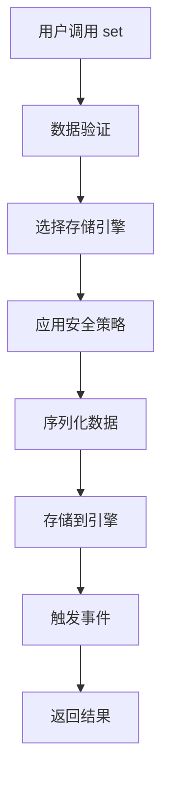
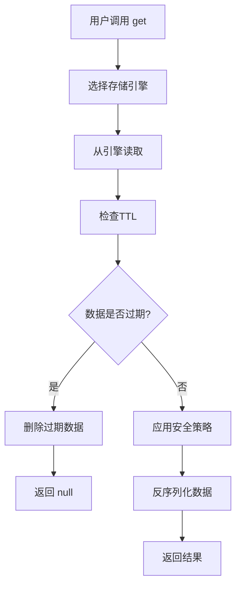

# 基础概念

## 🎯 核心概念

> 更多阅读：
> - [命名空间](/guide/namespaces) · [API](/api/namespace)
> - [批量操作](/api/batch)
> - [缓存预热](/api/warmup)
> - [跨标签页同步](/api/sync)

### 缓存管理器 (CacheManager)

缓存管理器是整个库的核心，它提供了统一的 API 来管理不同的存储引擎。

```typescript
import { createCache } from '@ldesign/cache'

const cache = createCache({
  defaultEngine: 'localStorage',
  keyPrefix: 'myapp_',
})
```

**主要职责：**

- 管理多个存储引擎
- 提供统一的 CRUD 接口
- 处理数据序列化和反序列化
- 实现智能存储策略
- 管理缓存生命周期

### 存储引擎 (Storage Engine)

存储引擎是实际执行数据存储操作的组件。每个引擎都实现了相同的接口，但底层使用不同的存储技术。

#### 支持的存储引擎

| 引擎               | 特点                 | 适用场景           |
| ------------------ | -------------------- | ------------------ |
| **localStorage**   | 持久化、同域共享     | 用户配置、偏好设置 |
| **sessionStorage** | 会话级、标签页隔离   | 临时状态、表单数据 |
| **Cookie**         | 服务器交互、有限容量 | 认证令牌、跟踪数据 |
| **IndexedDB**      | 大容量、结构化查询   | 离线数据、复杂对象 |
| **Memory**         | 高性能、易失性       | 计算缓存、临时数据 |

### 智能策略 (Smart Strategy)

智能策略根据数据特征自动选择最适合的存储引擎，无需手动指定。

```typescript
const cache = createCache({
  strategy: {
    enabled: true,
  },
})

// 小数据 → localStorage
await cache.set('config', { theme: 'dark' })

// 大数据 → IndexedDB
await cache.set('dataset', largeArray)

// 短期数据 → Memory
await cache.set('temp', data, { ttl: 5000 })
```

**策略因素：**

- **数据大小** - 小数据用 localStorage，大数据用 IndexedDB
- **TTL 时长** - 短期用 Memory，长期用 localStorage
- **数据类型** - 简单类型用 localStorage，复杂对象用 IndexedDB
- **访问频率** - 高频访问优先使用 Memory

### 安全特性 (Security)

提供数据加密和键名混淆功能，保护敏感信息。

```typescript
const cache = createCache({
  security: {
    encryption: {
      enabled: true,
      secretKey: 'your-secret-key',
    },
    obfuscation: {
      enabled: true,
    },
  },
})

// 数据会被自动加密存储
await cache.set('sensitive-data', { password: '123456' })
```

## 🔄 数据流程

### 设置数据流程



### 获取数据流程



## 🎨 设计模式

### 外观模式 (Facade Pattern)

CacheManager 作为外观，隐藏了底层存储引擎的复杂性：

```typescript
// 用户只需要简单的 API
await cache.set('key', 'value')
await cache.get('key')

// 内部处理：引擎选择、序列化、安全策略等
```

### 策略模式 (Strategy Pattern)

不同的存储引擎实现相同的接口，可以动态切换：

```typescript
interface IStorageEngine {
  set: (key: string, value: any, options?: any) => Promise<void>
  get: (key: string) => Promise<any>
  remove: (key: string) => Promise<void>
  clear: () => Promise<void>
}
```

### 工厂模式 (Factory Pattern)

StorageEngineFactory 负责创建存储引擎实例：

```typescript
const engine = await StorageEngineFactory.create('localStorage', config)
```

### 观察者模式 (Observer Pattern)

事件驱动的架构，支持监听缓存操作：

```typescript
cache.on('set', (event) => {
  console.log('数据已设置:', event)
})

cache.on('get', (event) => {
  console.log('数据已获取:', event)
})
```

## 📊 数据结构

### 缓存项结构

```typescript
interface CacheItem {
  value: any // 实际数据
  timestamp: number // 创建时间戳
  ttl?: number // 生存时间（毫秒）
  metadata?: {
    // 元数据
    size: number // 数据大小
    type: string // 数据类型
    engine: string // 存储引擎
  }
}
```

### 配置结构

```typescript
interface CacheOptions {
  defaultEngine?: StorageEngine
  keyPrefix?: string
  defaultTTL?: number
  debug?: boolean
  strategy?: StorageStrategyConfig
  security?: SecurityConfig
  engines?: StorageEngineConfig
}
```

## 🔧 生命周期

### 初始化阶段

1. **创建实例** - 解析配置选项
2. **初始化引擎** - 异步初始化各个存储引擎
3. **验证可用性** - 检查引擎是否可用
4. **设置策略** - 配置智能选择策略
5. **启动清理** - 开始定期清理过期数据

### 运行阶段

1. **接收请求** - 处理用户的缓存操作
2. **引擎选择** - 根据策略选择最优引擎
3. **数据处理** - 序列化、加密、压缩
4. **执行操作** - 调用存储引擎执行操作
5. **事件通知** - 触发相应的事件

### 清理阶段

1. **过期检查** - 定期检查过期数据
2. **内存管理** - LRU 算法清理内存缓存
3. **存储优化** - 压缩和整理存储空间
4. **统计更新** - 更新使用统计信息

## 🎯 最佳实践

### 1. 合理选择存储引擎

```typescript
// ✅ 推荐：让智能策略自动选择
const cache = createCache({ strategy: { enabled: true } })

// ❌ 不推荐：硬编码引擎选择
const cache = createCache({ defaultEngine: 'localStorage' })
```

### 2. 设置合适的 TTL

```typescript
// ✅ 推荐：根据数据特性设置TTL
await cache.set('user-session', sessionData, { ttl: 30 * 60 * 1000 }) // 30分钟
await cache.set('user-config', configData, { ttl: 7 * 24 * 60 * 60 * 1000 }) // 7天

// ❌ 不推荐：所有数据使用相同TTL
await cache.set('data', value, { ttl: 60000 })
```

### 3. 处理异步操作

```typescript
// ✅ 推荐：正确处理异步操作
try {
  const value = await cache.get('key')
  if (value !== null) {
    // 处理数据
  }
}
catch (error) {
  console.error('缓存操作失败:', error)
}

// ❌ 不推荐：忽略异步特性
const value = cache.get('key') // 返回 Promise，不是实际值
```

### 4. 合理使用键名

```typescript
// ✅ 推荐：使用有意义的键名
await cache.set('user:123:profile', userProfile)
await cache.set('config:theme', themeConfig)

// ❌ 不推荐：使用无意义的键名
await cache.set('data1', userProfile)
await cache.set('x', themeConfig)
```

## 🔗 相关概念

### TTL (Time To Live)

生存时间，指定缓存项的有效期。过期后数据会被自动清理。

### LRU (Least Recently Used)

最近最少使用算法，当内存缓存达到容量限制时，优先清理最久未使用的数据。

### 序列化 (Serialization)

将 JavaScript 对象转换为字符串的过程，以便存储到不支持对象的存储引擎中。

### 混淆 (Obfuscation)

对键名进行编码处理，防止敏感信息通过键名泄露。

### 加密 (Encryption)

对数据内容进行加密处理，确保即使存储被访问也无法直接读取敏感信息。
